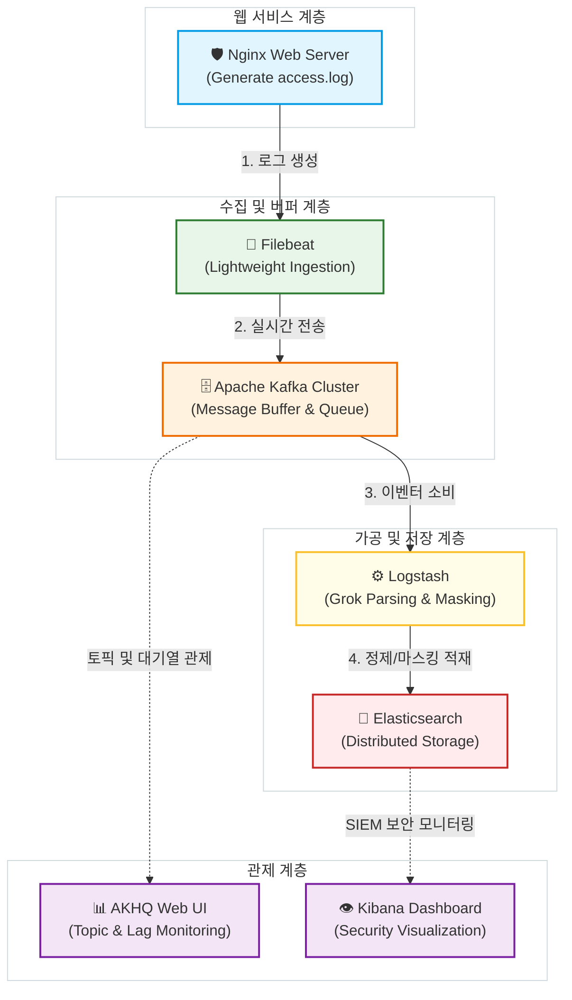
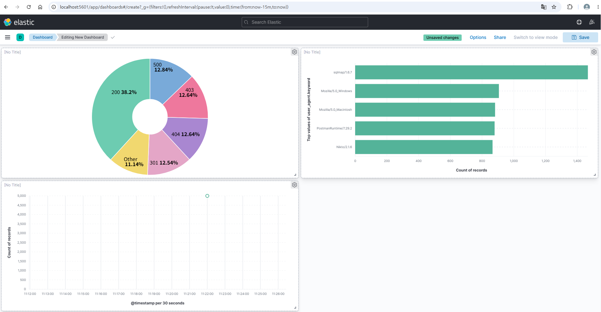

# 🛡️ 대용량 보안 로그 실시간 수집 및 관제를 위한 SIEM 데이터 파이프라인

본 프로젝트는 가상화 인프라 환경(Docker)을 기반으로 운영 서버의 부하를 최소화하며 대용량 웹 트래픽 로그를 실시간으로 수집하고, 데이터 폭주 상황에서도 유실 없는 안정적인 버퍼링 계층(Kafka) 및 실시간 가공 정제 엔진(Logstash)을 거쳐 분산 저장소(Elasticsearch)와 가시성 도구(Kibana, AKHQ)로 연동되는 End-to-End SIEM(보안 정보 및 이벤트 관리) 데이터 파이프라인 인프라 생태계입니다.

---

## 🏗️ 1. 시스템 아키텍처 (System Architecture)



### 🧩 컴포넌트별 핵심 역할
* **Nginx**: 실제 상용 환경의 웹 서비스를 대변하며 보안 분석의 대상이 되는 원본 로그를 생성합니다.
* **Filebeat**: CPU/Memory 오버헤드가 적은 경량 에이전트로, 오직 `access.log`만을 정밀 타깃팅하여 보안 데이터 노이즈를 방지합니다.
* **Apache Kafka**: 분당 수만 건의 DDoS 공격이나 웹 스캐닝이 발생하는 대규모 장애 상황에서도 로그 유실을 원천 차단하는 완충지대(Buffer) 역할을 수행합니다.
* **Logstash**: 정교한 **Grok 필터**를 통해 통문장 문자열 로그를 필드 단위(`client_ip`, `status_code`, `request` 등)로 파싱하고, 금융권 보안 가이드라인을 준수하여 내부 자산 및 개인정보 보호를 위한 **IP 주소 뒷자리 마스킹 처리(`172.18.0.xxx`)**를 수행하는 ETL 엔진입니다.
* **Elasticsearch**: 대용량 가공 로그를 실시간으로 인덱싱하는 분산형 빅데이터 저장소입니다.
* **Kibana & AKHQ**: 파이프라인의 실시간 데이터 인젝션 상태를 시각적으로 추적하고 침입 흔적을 한눈에 식별할 수 있도록 지원하는 웹 관제 솔루션입니다.
* **Zookeeper**: 분산 버퍼인 Apache Kafka 클러스터의 메타데이터를 중앙 관리하고, 브로커의 생사 확인 및 컨트롤러 선출을 전담하는 분산 코디네이터 인프라입니다.

---

## 🛠️ 2. 엔지니어링 실증 검증 및 아카이빙 (BMT Logs)
본 프로젝트는 시스템의 한계점을 단순 예측하지 않고, 대규모 부하 테스트(BMT) 툴을 활용하여 인프라의 가용성과 자원 절감 지표를 정량적으로 도출하고 아카이빙했습니다. 더불어 금융 운영 요건 충족을 위한 고가용성 도큐멘테이션을 완비했습니다.

* 🔍 [인프라 호환성 및 권한 장애 트러블슈팅 문서 바로가기](./docs/TROUBLE_SHOOTING.md)
* 📈 [대규모 부하 테스트(TPS) 및 정량적 성능 검증 문서 바로가기](./docs/BENCHMARK_TEST.md)
* 🛡️ [금융권 규격 고가용성(HA) Active-Active 이중화 설계 제안서 바로가기](./docs/HA_ARCHITECTURE_PLAN.md) 🔥

### 📊 3단계 벤치마크 핵심 검증 지표 (Key Results)

1. **대량 트래픽 수집 한계점 검증 (시나리오 1)**
   - **최대 로그 수집 처리량**: **12,214.22 TPS** 달성 (Apache Bench 동시성 100 기준)
   - **종단 간 데이터 유실률**: **0.00% (Zero Leakage)** 입증 (10,000건 인젝션 후 Elasticsearch 실물 데이터 전수 검증)
   - **평균 트래픽 응답 속도**: **8.187 ms**로 지연 없는 타이트한 네트워킹 가용성 확보

2. **완충 작용 및 백압 제어(Backpressure) 검증 (시나리오 2)**
   - 후속 가공 엔진(Logstash) 강제 중단 상황 속에서도 최전방 웹 서버 가용성 유지율 **100.00%** 사수.
   - 대규모 스파이크 트래픽 **15,000건**을 Kafka 내 가상 지연 큐(**Max Lag: 15,000**)로 유실 없이 격리 보관 처리.
   - 프로세스 재가동 즉시 백압 제어 매커니즘이 작동하여 단 1건의 유실 없이 대기열 완전 드레인 및 **`Lag: 0` 수렴** 실증.

3. **JVM 힙 메모리 최적화 자원 최적화 (시나리오 3)**
   - Elasticsearch 및 Logstash에 JVM 튜닝 핀포인트 제어 옵션(`-Xms1g -Xmx1g`) 적용.
   - 순정 상태(Elasticsearch 기동 즉시 호스트 자원의 61.25%인 2.343GiB 독점) 대비 **물리 메모리 자원 약 35% 이상 획기적 절감** 완료.
   - 고부하 연산 및 자원 압축 상황(Java GC) 속에서도 OOM 컨테이너 크래시 프리 상태를 보장하여 인프라 가성비 극대화.

---

## 👁️ 3. 실시간 SIEM 통합 관제 대시보드

정상 트래픽 이외에 악성 해킹 스캔 툴(`sqlmap`, `Nikto`), 웹 취약점 접근 시도(`403 Forbidden`), 인프라 내부 장애(`500 Internal Error`) 등 **다채로운 모의 위협 시나리오 로그 5,000건을 파이프라인에 실시간 강제 인젝션**하여 탐지 및 통계 성능을 입증했습니다.



* **서버 건전성 관제**: 전체 트래픽 중 에러 코드 비율을 파이 챠트(Pie Chart)로 도출하여 이상 징후 실시간 추적.
* **침입사고 탐지**: 비정상적인 취약점 스캐너의 User-Agent를 가로 막대 그래프로 랭킹화하여 악성 자산 접근 핀포인트 식별.

---

## 🚀 4. 시작하기 (Quick Start)

현실 세계(호스트 리눅스)와 컨테이너 환경을 격리 및 동기화하기 위해 디렉토리를 바인드 마운트하여 구동합니다.

```bash
# 1. 원본 로그 저장 디렉토리 선제 생성 및 소유권 확보
mkdir -p web/logs/nginx
sudo chown -R $USER:$USER web/logs

# 2. 인프라 전체 일괄 기동 (백그라운드)
docker compose up -d

# 3. 테스트용 의도적 부하 트래픽 주입 (15회 자동 호출)
for i in {1..15}; do curl -s http://localhost > /dev/null; done

# 4. 관제 데이터 다각화를 위한 가상 위협 로그 5,000건 주입 스크립트 가동
./generate_mock_logs.sh
```

* **AKHQ 토픽 웹 관제**: 브라우저에서 `http://localhost:8080` 접속 ➡️ `Consumers` 대기열 상태 확인
* **Kibana 실시간 관제 대시보드**: 브라우저에서 `http://localhost:5601` 접속 후 `logstash-*` 데이터 뷰 등록
