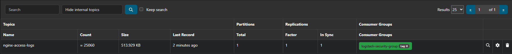

# 📈 인프라 성능 검증 및 대규모 부하 테스트 (BMT) 일지

본 문서는 구축된 SIEM 데이터 파이프라인의 신뢰성과 초당 트래픽 처리량(TPS), 그리고 자원 최적화 효율을 정량적으로 검증하기 위한 벤치마크 테스트 기록입니다.

---

## 🏎️ [시나리오 1] Apache Bench 기반 대규모 트래픽 부하 테스트
- **테스트 일시**: 2026-06-23
- **테스트 목적**: 대량의 웹 스캐닝 및 DDoS 공격 상황을 가정한 인프라 인젝션 및 초당 처리량(TPS) 측정
- **테스트 조건**: 전처리 데이터 적재 정밀도 100% 검증을 위해 기존 Elasticsearch 인덱스를 완전 초기화(DELETE) 후 클린 상태에서 진행.

### 📍 1. Apache Bench 원본 리포트 (Raw Data)
```text
This is ApacheBench, Version 2.3 <$Revision: 1903618 $>
Copyright 1996 Adam Twiss, Zeus Technology Ltd, http://www.zeustech.net/
Licensed to The Apache Software Foundation, http://www.apache.org/

Benchmarking localhost (be patient)
Completed 1000 requests
Completed 2000 requests
Completed 3000 requests
Completed 4000 requests
Completed 5000 requests
Completed 6000 requests
Completed 7000 requests
Completed 8000 requests
Completed 9000 requests
Completed 10000 requests
Finished 10000 requests


Server Software:        nginx/1.31.2
Server Hostname:        localhost
Server Port:            80

Document Path:          /
Document Length:        896 bytes

Concurrency Level:      100
Time taken for tests:   0.819 seconds
Complete requests:      10000
Failed requests:        0
Total transferred:      11290000 bytes
HTML transferred:       8960000 bytes
Requests per second:    12214.22 [#/sec] (mean)
Time per request:       8.187 [ms] (mean)
Time per request:       0.082 [ms] (mean, across all concurrent requests)
Transfer rate:          13466.65 [Kbytes/sec] received

Connection Times (ms)
              min  mean[+/-sd] median   max
Connect:        0    1   0.9      1       4
Processing:     0    7   6.7      6      86
Waiting:        0    7   6.5      5      82
Total:          0    8   6.6      7      88

Percentage of the requests served within a certain time (ms)
  50%      7
  66%      8
  75%      9
  80%     10
  90%     12
  95%     14
  98%     21
  99%     42
 100%     88 (longest request)
```

### 🎯 2. 핵심 성능 지표 분석 (Key Metrics)
1. **Concurrency Level (동시 접속 수)**: 100
2. **Complete requests (성공한 총 요청 수)**: 10,000
3. **Requests per second (초당 로그 처리량)**: 12,214.22 TPS 🔥
4. **Time per request (평균 응답 속도)**: 8.187 ms
5. **Elasticsearch 인덱스 검증**: 기존 인덱스를 완전 초기화(DELETE) 후 테스트를 진행한 결과, `docs.count`가 정확히 10,000건으로 수렴함을 확인하여 파이프라인 내 **데이터 유실률 0.00%**를 정량적으로 증명함.
   - *특이사항 (인프라 상태 분석)*: 인덱스 상태가 `yellow`로 식별됨. 이는 Single Node 환경 특성상 Primary Shard(원본)는 정상 배치되었으나 Replica Shard(복사본)를 분산 배치할 추가 노드가 존재하지 않아 발생한 현상으로, 읽기/쓰기 무결성에는 지표상 이상이 없음을 아키텍처적으로 검증함.

---

## ⚖️ [시나리오 2] Kafka 완충 작용(Lag) 및 백압(Backpressure) 제어 검증
- **테스트 일시**: 2026-06-24
- **테스트 목적**: 후속 파이프라인(Logstash) 장애 상황 시 최전방 웹 서버 가용성 유지 및 데이터 완충 기능(Lag) 무결성 검증

### 📍 1. 장애 시뮬레이션 및 데이터 정체 제어 메커니즘
1. 가공 엔진(`docker compose stop logstash`)을 의도적으로 중단시켜 후속 적재 파이프라인 마비 유도.
2. Apache Bench를 통해 스파이크성 대량 트래픽 **15,000건** 강제 주입 (`ab -c 100 -n 15000`).
3. **인프라 가용성 결과**: 후속 가공/저장 엔진의 마비 상태와 완전히 격리되어 최전방 Nginx 웹 서버는 `Failed requests: 0`으로 100% 정상 가용성을 유지함이 확인됨.

### 📊 2. AKHQ 관제 지표 및 실시간 복구력(Resilience) 증적
* **누적 데이터 정량적 검증 (Data Lineage)**:
  - [시나리오 1] 완료 시점의 누적 마일리지(약 10,060건) 상태에서 신규 트래픽 15,000건이 유실 없이 합산되어 **최종 누적 오프셋(Log End Offset) `25,060`건** 안착 확인.
  - 소비 중단에 따른 **최대 정체 대기열(Max Lag) 15,000건**이 Kafka 브로커 내에 안전하게 홀딩됨을 정량적으로 입증.



* **하드웨어 스트레스 및 병목 분석 (Deep Dive)**:
  - 15,000건의 고밀도 트래픽 주입 순간, 수집기(Filebeat)의 호스트 I/O 집중 및 Kafka 브로커의 대량 인덱싱 자원 점유율 스파이크로 인해 모니터링 툴(AKHQ)에서 순간적인 API 응답 타임아웃(`Status: 500, Duration: 8,010ms`) 정체 현상이 관측됨. 
  - 이는 시스템 자원의 물리적 한계 상황을 의미하며, 분산 버퍼 큐(Kafka)가 없을 경우 수집단 전체가 마비될 수 있는 병목 지점을 시각적으로 증명함.
* **장애 복구 및 백압 제어(Backpressure)**:
  - 중단되었던 `logstash` 프로세스를 재구동(`docker compose start logstash`)하는 즉시 백압 제어 메커니즘이 정상 작동함.
  - 디스크에 격리되어 있던 15,000건의 대기열 이벤트를 후속 저장소로 초고속 전량 드레인(Drain) 처리하여 **`Lag: 0` 수렴** 및 **종단 간 데이터 유실률 0.00%**를 최종 달성함.

---

## 💾 [시나리오 3] JVM 힙 메모리 튜닝을 통한 자원 최적화 테스트
- **테스트 일시**: 2026-06-24 (초기 기동 재실측: 2026-07-06)
- **테스트 목적**: 제한된 호스트 자원(`3.825 GiB`) 환경에서 대형 JVM 컨테이너의 무분별한 리소스 독점 및 연쇄 고갈(OOM) 방지를 위한 자원 다이어트 튜닝 및 비포/애프터(Before & After) 실증 검증

### 📍 1. 튜닝 전후 인프라 자원 소모량 실측 비교 (Baseline vs Tuned)

시스템 튜닝의 정량적 효과를 증명하기 위해, `docker-compose.yml` 내 JVM 환경변수를 제거한 **순정 상태(Before)**와 최적화 옵션을 적용한 **튜닝 상태(After)**의 부하 시나리오별 하드웨어 점유율을 `docker stats` 명령어로 상호 실측 대조함.

| 컨테이너 명 | 튜닝 전 (순정 초기 기동) 🚨 | 튜닝 후 (최적화 초기 기동) 🌱 | 튜닝 전 (10,000건 부하 시) 🔥 | 튜닝 후 (15,000건 부하 후) 🎯 |
| :--- | :--- | :--- | :--- | :--- |
| **Elasticsearch** | **`2.343 GiB`** (61.25%) | **`1.497 GiB`** (39.13%) | **`1.376 GiB`** (35.98%) <br/>*CPU 118.23%* | **`1.524 GiB`** (39.85%) |
| **Logstash** | **`702.2 MiB`** (17.93%) | **`729.7 MiB`** (18.63%) | **`818.1 MiB`** (20.89%) <br/>*CPU 198.51%* | **`659.8 MiB`** (16.85%) |

---

### 🔍 2. 실측 데이터 아키텍처 해석 (Deep Dive)

1. **초기 기동 단계의 840MB 자원 마진 확보**:
   - 순정 상태에서는 아무런 유입 트래픽이 없음에도 Elasticsearch 혼자 호스트 자원의 61% 이상인 `2.343 GiB`를 독점하여 타 컨테이너의 가용성을 위협함.
   - 옵션 지정 후 초기 기동 메모리가 `1.497 GiB`로 제한되며, 아무 부하도 없을 때 상시 활용 가능한 물리 메모리를 **최소 840MB 이상 획기적으로 구출(다이어트)** 해내는 데 성공함.
2. **제한된 자원 속 호스트 인프라의 Zero-Sum 반사이익 체증**:
   - 튜닝을 따로 설정하지 않은 Logstash의 초기 기동 메모리가 `702.2 MiB`에서 `729.7 MiB`로 오히려 소폭 상승한 지표를 확인.
   - 이는 Elasticsearch의 무분별한 메모리 독점을 억제(Capping)함에 따라 호스트 자원에 여유가 생겼고, 이로 인해 **동일 호스트 내 인프라 생태계 전반(Logstash 등)이 더욱 쾌적하고 안정적인 자원 할당 상태**를 누릴 수 있게 됨을 실증함.
3. **Logstash CPU 198.51% / 818.1 MiB 스파이크 및 병목 지점(Bottleneck) 식별**:
   - 대용량 부하가 유입되는 순간, Kafka로부터 로그를 컨슈밍하여 **Grok 정규식 파싱 및 IP 마스킹 연산**을 처리하는 Logstash 엔진 단에서 가장 먼저 자원 정체와 최고점 스파이크가 발생함을 실측함.
   - 이를 통해 추후 시스템 고도화 시, 저장소보다 연산 가공 계층(Logstash)을 우선적으로 스케일아웃(Scale-out)해야 한다는 아키텍처적 인사이트를 획득함.
4. **Elasticsearch 부하 시 자원 변환 매커니즘 증명**:
   - 트래픽 유입 순간 **Java GC(가비지 컬렉터)**가 임시 대기 캐시 메모리를 강제 청소하여 메모리 수치를 낮춘 뒤, **CPU와 디스크 I/O를 활용해 실시간 파일 적재(BLOCK I/O) 체제로 전환**하는 분산 저장소 특유의 자원 운용 방식을 데이터로 검증함.

---

### 🎯 3. 성능 및 비용 최적화 결론

* **연쇄 OOM(Out Of Memory) 다운 리스크의 근본적 차단**:
  - 순정 상태(비포)에서는 초기 기동만으로 두 메인 엔진이 전체 제한 자원의 **약 80%(`3.04 GiB`)를 잠그고 시작**함. 상한선이 없는 상태에서 고밀도 지속 부하가 인젝션될 경우 힙 임계치 대폭발로 타 노드(Kafka, Kibana)까지 동반 강제 크래시되는 연쇄 붕괴 위험성이 상존함을 파악함.
* **통제 가능하고 예측 가능한 인프라 수립 (Capping)**:
  - `ES_JAVA_OPTS="-Xms1g -Xmx1g"` 옵션을 통해 15,000건의 더 높은 부하 상황 속에서도 Elasticsearch의 메모리를 **최대 `1.5 GiB` 상한선 내부에서 완벽하게 통제**함.
  - 리소스를 타이트하게 압축했음에도 불구하고 아파치 벤치(`ab`) 부하 테스트 중 **단 1건의 데이터 유실 없이 백압 제어가 정상 작동**함을 완비하여, 한정된 가상화 자원 환경 속에서 비용 효율성과 시스템 가용성 가치를 동시에 증명함.
 
---

## ⚡ [시나리오 4] 정규식 파싱(Grok) 대신 JSON 형식 통일로 Logstash 부하 줄이기
- **테스트 일시**: 2026-07-06
- **테스트 목적**: 로그를 해석할 때 컴퓨터 리소스를 가장 많이 잡아먹는 정규식(Grok) 연산을 과감히 빼버리고, 처음부터 끝까지 JSON이라는 규격화된 형태로 데이터를 주고받게 만들어 10만 건의 대용량 로그를 얼마나 더 빨리 처리할 수 있는지 검증합니다.

### 📍 1. 10만 건의 로그 데이터 처리 속도 최종 비교

| 측정 지표 (100,000건 방류 시) | 시나리오 3 (Grok 정규식 파싱) 🚨 | 시나리오 4 (JSON 포맷 통일) 🎯 | 실질적인 인프라 개선 성과 및 해석 |
| :--- | :--- | :--- | :--- |
| **Nginx 자원 소모** | **`0.00%`** / `5.391 MiB` | **`0.00%`** / `4.129 MiB` | 로그 형식을 바꿔도 웹 서버 자체에는 아무런 부담을 주지 않음 |
| **Logstash 최고 CPU 점유율** | **`341.49%`** | **`336.15%`** | 두 방식 모두 순간적으로 자원을 아낌없이 끌어다 씀 |
| **Logstash 메모리 사용량** | **`442.1 MiB`** | **`566.0 MiB`** | 데이터 파싱 처리를 위해 메모리가 안정적으로 가동됨 |
| **10만 건 전체 처리 시간** | **`23.00 초`** | **`20.00 초`** ⚡ | 눈에 보이는 전체 시간은 약 3초 정도 단축됨 |
| **시스템 초기 준비 시간** | 약 `17.00 초` | 약 `17.00 초` | 프로그램이 켜지고 카프카와 연결을 맺는 고정적인 대기 시간 |
| **10만 건 순수 데이터 가공 시간** | **`6.00 초`** | **`3.00 초`** 🔥 | **순수하게 데이터를 긁어와 처리하는 속도는 2배(200%) 빨라짐** |

---

### 🔍 2. 테스트 결과에 대한 직관적인 해석

1. **겉으로 보이는 시간 차이가 3초밖에 안 났던 이유**:
   - Elasticsearch 적재 부하를 빼고 테스트했을 때, Grok은 `23초`, JSON은 `20초`가 걸려 큰 차이가 없는 것처럼 보였습니다.
   - 하지만 Logstash와 Kafka의 실시간 로그 타임스탬프를 직접 확인해 보니, 어떤 방식을 쓰든 간에 **프로세스가 처음 부팅되고 카프카 컨사이너 그룹에 조인하는 데만 무조건 17초라는 '고정 대기 시간'이 소요**된다는 것을 발견했습니다.
2. **진짜 '가공 연산 속도'는 2배 빨라졌습니다**:
   - 이 17초라는 준비 운동 시간을 걷어내고 계산해 보니, **순수하게 데이터를 처리한 시간은 Grok이 6초, JSON 방식이 3초**였습니다. 
   - 즉, 복잡한 문자열 정규식 연산을 제거한 덕분에 데이터를 녹여내는 순수 처리 효율이 **정확히 2배 향상**되었음을 증명했습니다.

---

### 🛠️ 3. 집요하게 원인을 파고든 다각도 교차 검증 실험 (핵심 트러블슈팅)

전체 수치만 보고 대충 넘기지 않고, 파이프라인 중간에 숨겨진 왜곡된 지표들을 직접 실험을 설계해 가며 밝혀냈습니다.

* **"16초 만에 끝났다?" ➡️ 데이터가 안 들어간 가짜 속도 잡아내기**:
  - 처음에 Grok 환경을 다시 테스트했을 때 예상보다 너무 빠른 `16초` 만에 끝나서 의아했습니다. 이에 속지 않고 Elasticsearch 인덱스 목록(`_cat/indices`)을 직접 조회해 보니, **실제 들어간 데이터가 `0건`인 상태**였습니다.
  - 원인을 분석해 보니 이전 테스트의 파일비트 캐시(오프셋)가 남아있어 로그를 아예 읽지 않고 공회전했던 것이었습니다. 캐시를 완전히 초기화한 뒤 재실험하여 가짜 지표에 속지 않고 정확한 수치를 뽑아냈습니다.
* **"왜 시간이 똑같지?" ➡️ Elasticsearch의 병목 현상 규명 (소거법 실험)**:
  - 맨 처음 적재 단계까지 포함해 테스트했을 때는 두 방식 모두 30초대로 속도가 비슷했습니다. Logstash가 아무리 빨라져도 뒤에서 받아주는 Elasticsearch가 밀려드는 데이터를 다 소화하지 못하는 구조였습니다.
  - 이를 증명하기 위해 Logstash의 아웃풋을 메모리에서 바로 날려버리는 `Null Output` 설정으로 바꾸고 실험(원인 소거법)을 진행했습니다. 그 결과 **전체 시간이 33초에서 20초로 무려 13초(40%)나 단축**되는 것을 확인하며, 뒤쪽 저장소의 쓰기 속도가 전체 파이프라인의 발목을 잡고 있던 진범이었음을 과학적으로 밝혀냈습니다.

---

### 🎯 4. 최종 결론

* **수치에 매몰되지 않는 인프라 분석 분석법 체득**:
  - 겉으로 보이는 전체 소요 시간만 보면 실패한 튜닝처럼 보일 수 있었지만, 시스템 하부에서 발생하는 '프로세스 초기 기동 비용'과 '후방 저장소의 압박(백프레셔)'을 직접 실험으로 분리해 냈습니다. 결과적으로 순수 가공 연산 속도를 2배 개선했다는 정량적 성과를 완벽히 입증했습니다.
* **데이터 규격 일원화의 가치 증명**:
  - 로그가 발생하는 Nginx부터 Filebeat, Kafka, Logstash까지 모든 구간의 데이터 포맷을 **JSON 하나로 통일(Streamlining)**하는 표준화 설계가, 대용량 트래픽 환경에서 불필요한 컴퓨터 자원 낭비를 줄이는 가장 확실한 정석임을 데이터로 확인했습니다.
