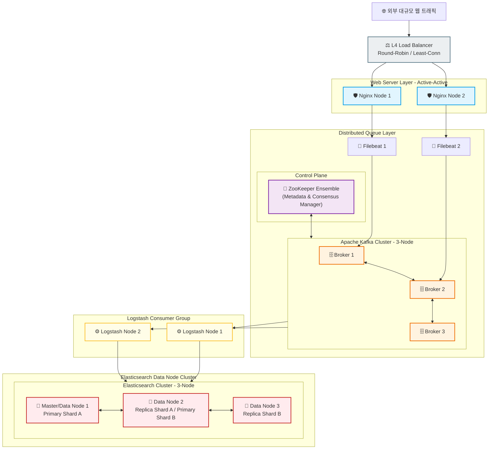

# 🛡️ 금융권 규격 고가용성(HA) 데이터 파이프라인 이중화 설계 제안서

본 문서는 단일 장애점(SPOF, Single Point of Failure)을 원천 제거하고, 금융권의 까다로운 전자금융감독규정(상시 가용성 및 재해복구 체계)을 충족하기 위한 엔터프라이즈급 이중화 및 분산 클러스터링 확장 가이드라인입니다.

---

## 🏗️ 1. 목표 아키텍처: Active-Active 고가용성 토폴로지

기존의 단일 컨테이너 레이어를 전 구간 분산 노드로 확장하여, 특정 인프라 장비가 물리적으로 파괴되거나 다운되어도 데이터 유실률 0%와 서비스 무중단을 보장합니다.

---

## 🎯 2. 컴포넌트별 고가용성(HA) 구성 전략

### 1) Nginx 웹 레이어: Active-Active 이중화
* **설계**: 최전방에 물리 **L4 로드밸런서**를 배치하여 트래픽을 상시 분산 처리.
* **장애 시나리오**: `Node 1`이 다운되더라도 L4 헬스체크 메커니즘에 의해 즉시 `Node 2`로 100% 트래픽이 전송되어 무중단 서비스 제공.

### 2) Apache Kafka & ZooKeeper: 뇌와 심장부의 분산 코디네이션
* **설계 (Control Plane)**: 3대의 Kafka 브로커 장비를 후방에서 지탱하는 **ZooKeeper Ensemble(앙상블)**을 배치하여 메타데이터 단일 진실 공급원(SSOT) 구축.
* **중앙 집중식 클러스터 제어 메커니즘**:
  - **임시 노드(Ephemeral Node) 기반 분산 상태 관리**: Kafka 브로커 기동 즉시 ZooKeeper에 임시 세션을 체결하여 Heartbeat를 감시함. 브로커 장애 단절 시 ZooKeeper가 즉시 이를 인지하고 감시(Watch) 매커니즘을 작동시켜 파이프라인 우회 경로를 동적 전파함.
  - **컨트롤러(Controller) 선출 보장**: 클러스터 총대장 역할을 수행할 브로커를 쿼럼(Quorum) 합의를 통해 선출하며, 기존 리더 브로커 다운 시 무중단 장애조치(Failover)를 자동 수행함.
* **금융권 신뢰성 무결성 (Data Plane)**: 토픽 설정에 **`Replication Factor: 3`**, **`min.insync.replicas: 2`**를 강제하고 수집기 전송 옵션을 **`acks=all`**로 바인딩함. ZooKeeper에 기록된 ISR(In-Sync Replicas) 동기화 상태 지표를 참조하여 최소 2대 이상의 브로커에 복제가 완료된 데이터만 신뢰 처리하도록 조치하여 금융권 규격의 '데이터 무손실(Zero Leakage)'을 달성함.

### 3) Logstash: Consumer Group 로드 밸런싱
* **설계**: 동일한 `group.id`를 공유하는 다중 Logstash 인스턴스를 수평 확장(Scale-out).
* **장애 시나리오**: 특정 Logstash 컨테이너가 가동 중단될 경우, Kafka의 **리밸런싱(Rebalancing)** 메커니즘에 의해 대기 중인 다른 Logstash 노드가 즉시 파티션 소유권을 이관받아 가공 공백 최소화.

### 4) Elasticsearch: Multi-Node 분산 클러스터 (Status: GREEN 🟢)
* **설계**: 3개 이상의 노드로 클러스터를 바인딩하고 `number_of_replicas: 1` 설정 적용.
* **기대 효과**: 원본방(Primary Shard)과 복사본방(Replica Shard)이 절대 동일 노드에 배치되지 않도록 격리하여, 싱글 노드 당시 발생했던 **`Yellow` 경고등을 `Green` 상태로 승격**시키고 하드웨어 고장에 완벽 대응.

---

## 📈 3. 향후 2차 로드맵 및 인프라 구현 계획

### 1) 인프라 매니페스트 및 인프라 코드화 (IaC) 분리
* 다중 분산 노드를 일괄 오케스트레이션하기 위한 프로덕션용 `docker-compose-ha.yml` 스크립트를 설계함.
* 향후 대규모 엔터프라이즈 환경으로 확장 시, 수백 대의 노드 배포 자동화 및 관리 효율성을 극대화하기 위해 인프라의 코드화(**IaC, Infrastructure as Code**) 솔루션인 **Ansible 및 Terraform** 도입 레이어를 수립함.

### 2) ZooKeeperless 아키텍처로의 전환 (KRaft 모드 마이그레이션)
* **레거시 결합 구조의 한계 인지**: 토픽과 파티션 수가 수만 개 이상으로 수평 확장될 때 발생하는 ZooKeeper-Kafka 간 메타데이터 동기화 지연 병목 현상 및 주키퍼 자체의 단일 장애점(SPOF) 리스크를 아키텍처적으로 분석함.
* **고도화 목표**: Kafka 자체 내부 알고리즘 및 Raft 합의 프로토콜을 활용해 메타데이터를 직접 제어하는 **KRaft (Kafka Raft Metadata Mode)** 마이그레이션을 2차 아키텍처 타깃으로 설정하여 운영 단순화와 클러스터 확장 가용성을 200% 달성할 계획임.
